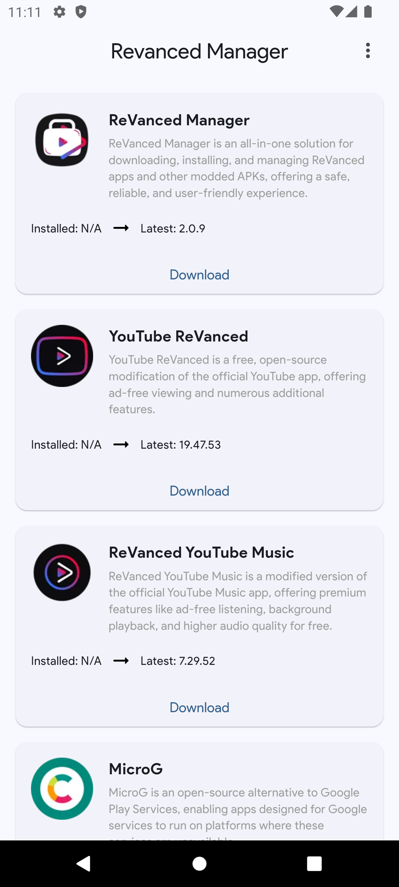
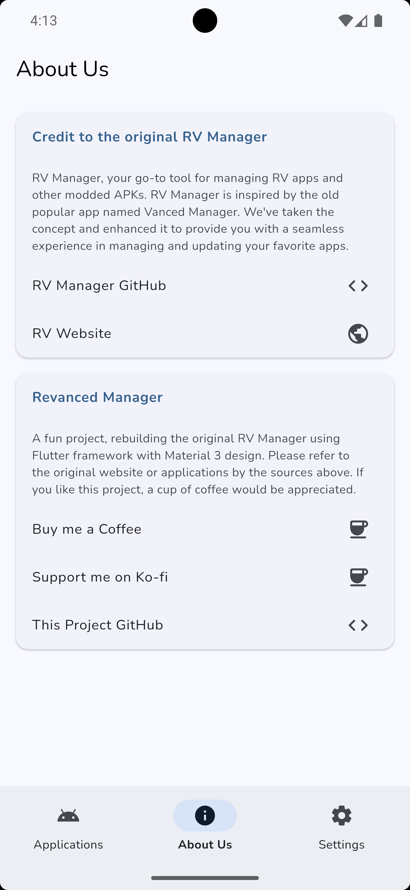
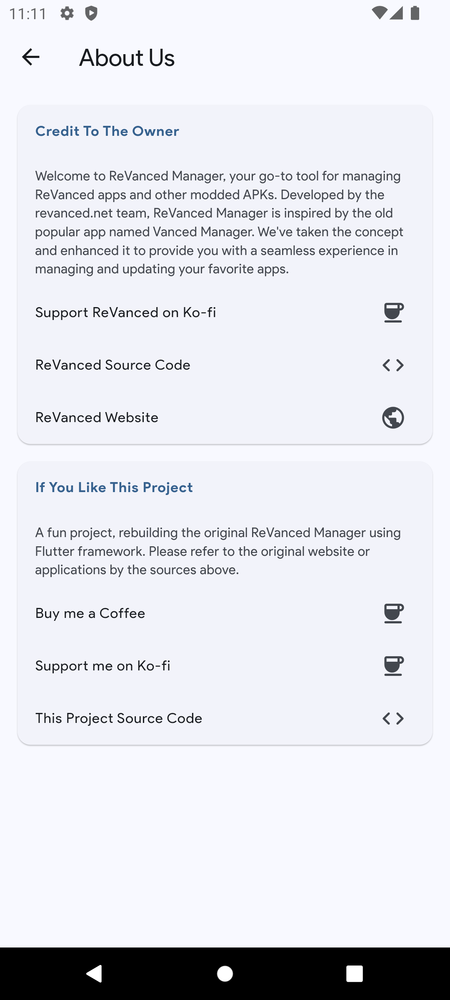
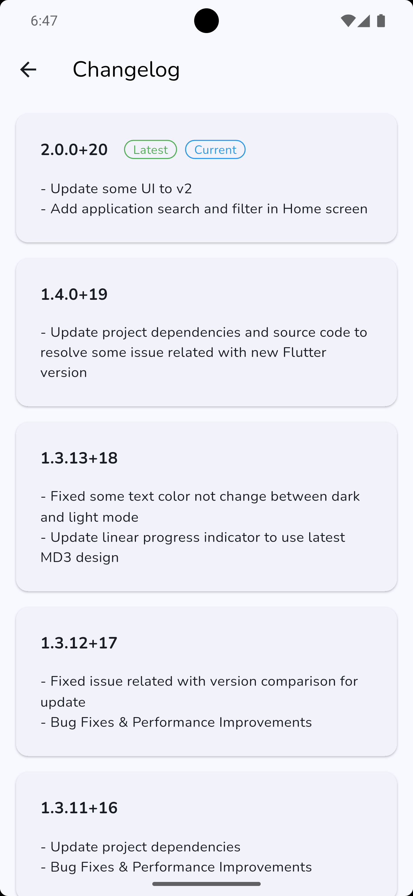
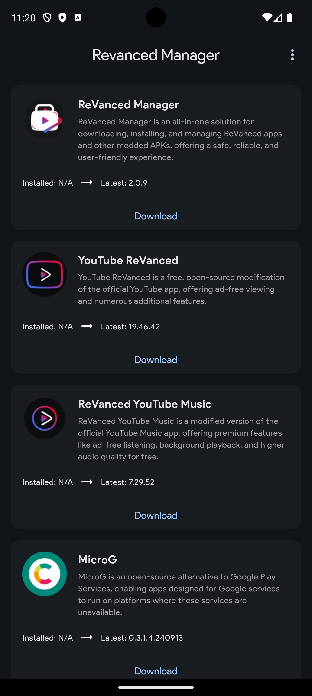
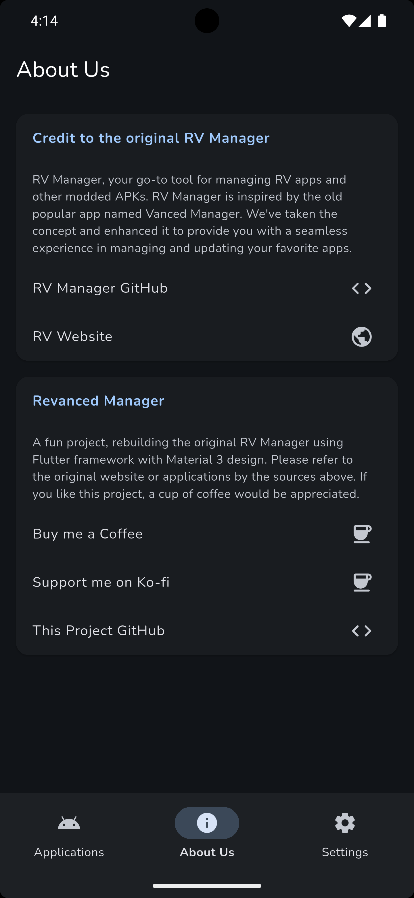
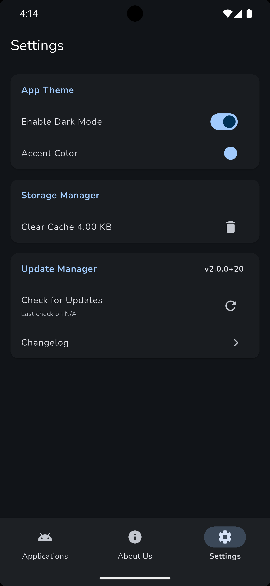
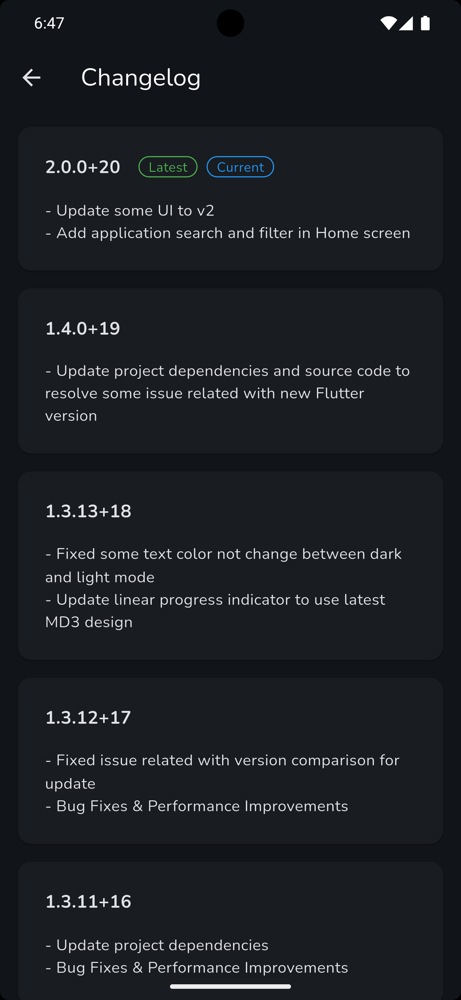

# Credit to the original RV Manager

RV Manager, your go-to tool for managing RV apps and other modded APKs. RV Manager is inspired by the old
popular app named Vanced Manager. We've taken the concept and enhanced it to provide you with a seamless experience in
managing and updating your favorite apps.

* RV Website: https://vanced.to
* RV Manager GitHub: https://github.com/vancedto/vanced-manager-plus

# This Project: Revanced Manager with Flutter framework

A fun project, rebuilding the original RV Manager using Flutter framework with Material 3 design. Please refer to the
original website or applications by the sources above. If you like this project, a cup of coffee would be appreciated.

# Light Mode

   

# Dark Mode

   