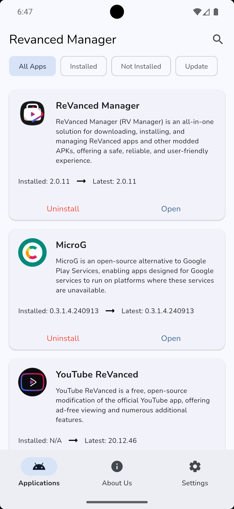
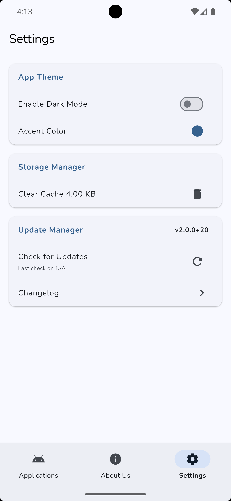
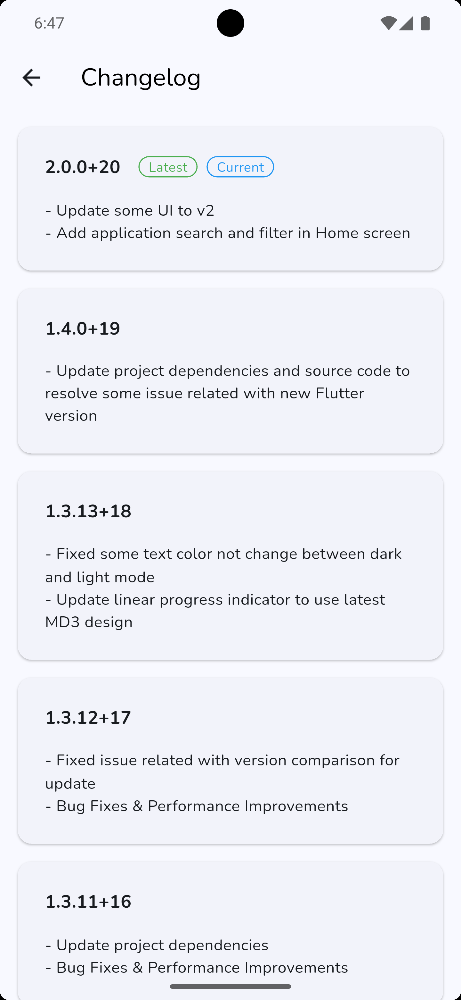
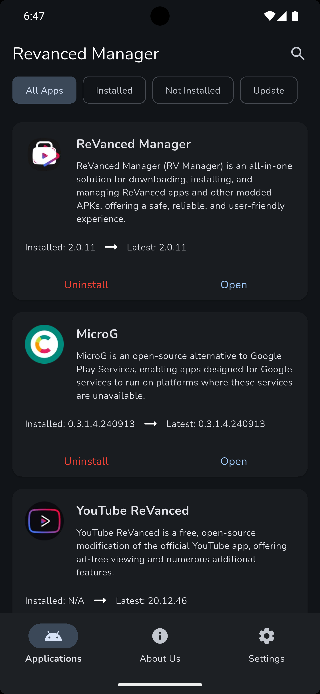
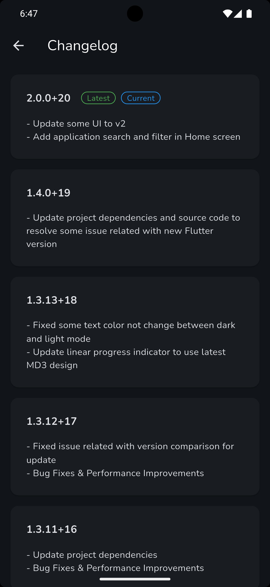

# Original ReVanced Apps

Welcome to ReVanced Manager, your go-to tool for managing ReVanced apps and other modded APKs. Developed by the
revanced.net team, ReVanced Manager is inspired by the old popular app named Vanced Manager. We've taken the concept and
enhanced it to provide you with a seamless experience in managing and updating your favorite apps.

* ReVanced website: https://revanced.net
* ReVanced Manager: https://github.com/revancedapps/revancedmanager

# Revanced Manager Flutter

A fun project, rebuilding the original ReVanced Manager using Flutter framework with Material 3 design. Please refer to
the original website or applications by the sources above.

 

# Light Mode

   

# Dark Mode

   